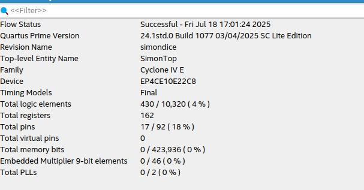
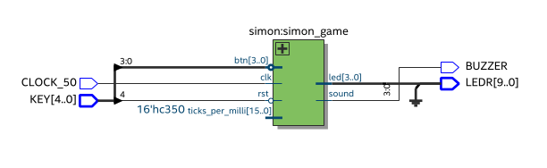
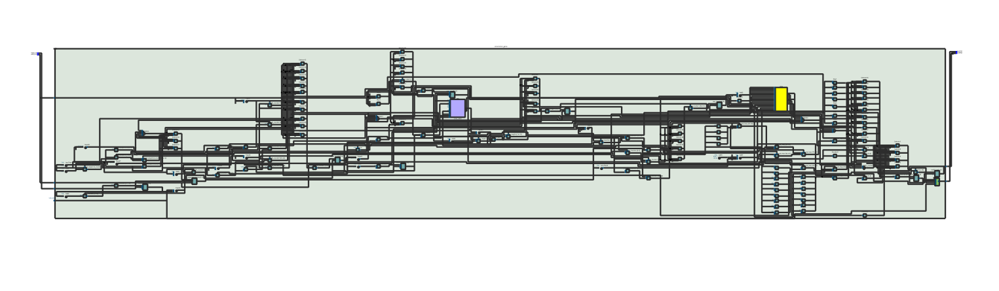
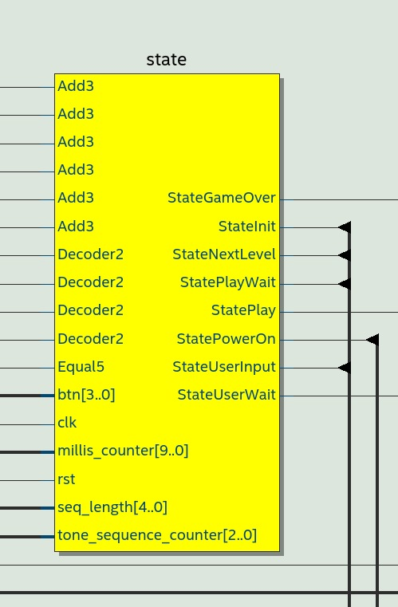
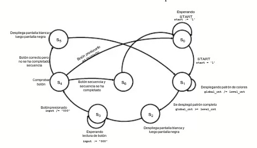
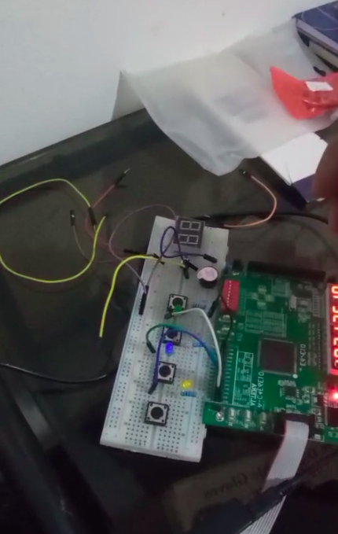
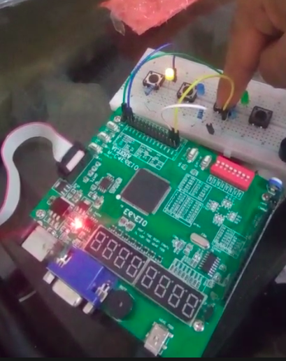
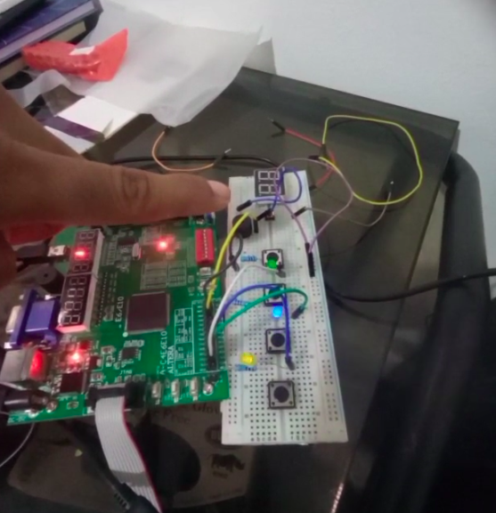

# Juego "Simón Dice"

## Integrantes

- [David Chaparro](https://github.com/DavidChaparro10)
- [Luís Montenegro](lfmontenegros@unal.edu.co)
- [Juan Rodríguez](Jrodiguezm@unal.edu.co)

## 1. Introducción

En la actualidad, muchos juegos interactivos disponibles para niños dependen de
dispositivos móviles, lo que puede conllevar a una sobreexposición a pantallas. Además,
se observa una falta de herramientas didácticas accesibles y económicas que refuercen el
desarrollo de habilidades cognitivas como la memoria, la atención y la concentración en
niños. Existe una oportunidad para diseñar dispositivos físicos simples, pero efectivos, que
estimulen estas habilidades de manera entretenida y educativa.

Este proyecto implementa el clásico juego "Simón Dice" utilizando el lenguaje de descripción de hardware Verilog. El juego consiste en memorizar y repetir secuencias crecientes de luces y sonidos, lo cual permite desarrollar habilidades de memoria y atención. La implementación se realizó para ser compatible con la FPGA Cyclone IV, utilizando botones, LEDs y un buzzer.

## 2. Arquitectura Implementada

El sistema se divide en tres módulos principales:

- **SimonTop**: Módulo principal que conecta el reloj del sistema, botones de entrada (`KEY`), LEDs (`LEDR`) y el buzzer. Instancia el módulo `simon` y el generador de sonido `play`.
  
- **simon**: Contiene la lógica del juego, organizada como una máquina de estados finita (FSM) con los siguientes estados:
  - `StatePowerOn`: Encendido inicial.
  - `StateInit`: Inicialización de la secuencia.
  - `StatePlay`: Reproducción de la secuencia.
  - `StateUserWait`: Espera de respuesta del usuario.
  - `StateUserInput`: Verificación del input del usuario.
  - `StateNextLevel`: Avance de nivel tras éxito.
  - `StateGameOver`: Finalización por error.

  Se utiliza un contador de milisegundos basado en el reloj del sistema (50 MHz) para controlar los tiempos de reproducción y espera. Las secuencias se generan pseudoaleatoriamente en función del tiempo de espera del usuario antes de empezar.

  El total de elementos lógicos usados, así como el total de pines usados se muestra en la siguiente gráfica:
  

**ÁREA UTILIZADA**
La FPGA Cyclone IV E – EP4CE10E22C8 tiene un total de 10,320 LEs disponibles.
Componentes de una LE (Logic Element)
LUT de 4 entradas
Se puede implementar como una memoria SRAM de 16 bits (2⁴ combinaciones).
Cada bit SRAM requiere ~6 transistores (estilo celdas 6T).
Total: 16 × 6 = 96 transistores
Multiplexores de selección (para elegir la salida)
Implementados con lógica CMOS (2–4 transistores por entrada).
Se usan varios para rutear entrada/salida de la LUT y flip-flop.
Estimado: ~40–60 transistores
Flip-Flop tipo D
Generalmente entre 20 y 30 transistores.
Estimado: ~24 transistores
Lógica de control adicional (enable, reset, clock)
Circuitería de control del FF y la LE.
Estimado: ~20–30 transistores
Una Logic Element (LE) en una FPGA Cyclone IV E contiene una LUT de 4 entradas, un flip-flop tipo D, y varios multiplexores. 

TOTAL	180–210 transistores por LE

La FPGA EP4CE10E22C8, con sus 10,320 LEs totales, tiene entre 1.8 y 2.2 millones de transistores solo en LEs, y más de 10 millones de transistores totales incluyendo todos los demás bloques.
Cada Logic Element (LE) se estima que contiene aproximadamente:

~180 a 210 transistores por LE

Utilizamos 430 Les De un total de 10,320 LEs disponibles en la FPGA Cyclone IV E – EP4CE10E22C8, Lo que corresponde al 4% de utilización, entonces:
430*(180 a 210 )= 77.400 a 90.300 Transistores  aproximadamente.

El bloque funcional del diseño es el siguiente:

  

  Haciendo zoom encontramos toda la lógica del juego:

  

  El cuadro de amarillo son los **estados**. Haciendo zoom encontramos los diferentes estados:
  

  En cuanto a la máquina de estados, fue la siguiente: 

  

- **play**: Generador de señal cuadrada para producir sonidos a partir de una frecuencia dada. Se usa para emitir tonos correspondientes a cada botón y efectos de éxito o fallo.

El diseño usa entradas activas bajas para los botones, e incluye melodías para indicar niveles completados y el fin del juego.

## 3. Pruebas

Se realizaron las siguientes pruebas:

- [Testbench](../src/simon_tb.v) en GTKWave
- Verificación de reproducción de secuencia de LEDs y sonidos:

- Confirmación de que los botones activan los LEDs y sonidos correctos.

- Comprobación del reinicio del juego desde el estado de Game Over.

- Eliminación del reinicio inesperado al usar el botón KEY[0], reasignándolo como botón de juego (LED 0).

Pruebas adicionales se realizaron en FPGA (Cyclone IV),  [verificando el comportamiento físico de los botones, los tiempos y el buzzer](video1.mp4).

## 4. Uso de Inteligencia Artificial

Durante el desarrollo del proyecto, se utilizó **ChatGPT (GPT-4)** como asistente para:

- Revisar y explicar el código base del juego "Simón Dice".
- Identificar errores de comportamiento en los botones.
- Proponer mejoras como la implementación del botón de reset.

La IA fue utilizada como apoyo en comprensión, depuración y documentación, pero toda la implementación fue verificada y adaptada por nosotros.

## 5. Conclusiones

El proyecto demostró que es posible implementar un juego interactivo clásico en hardware digital utilizando Verilog. El sistema es funcional tanto en simulación como en FPGA real, gracias al uso de una arquitectura modular y una FSM bien definida. La integración de sonido, tiempo, entrada de usuario y generación de secuencia aleatoria permitió una experiencia lúdica completa.

Además, se aprendió la importancia de gestionar correctamente los botones activos bajos y evitar conflictos entre señales de control como `reset` y entradas de juego.

## 6. Bibliografía

- Uri Shaked. Proyecto original en Wokwi: https://wokwi.com/projects/352319274216569857
- Intel Quartus Prime Documentation
